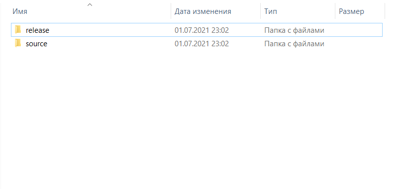
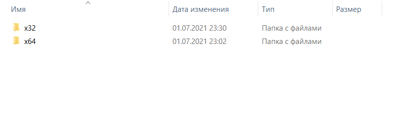
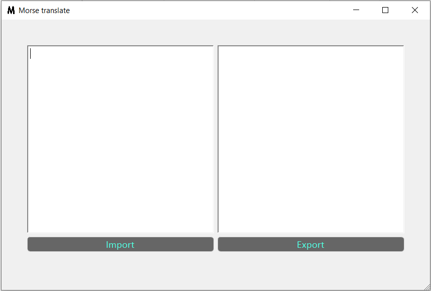

# Morse translate
Morse translate is instant translator of the Latin alphabet and some more [characters(1)](#all_symbols) into Morse code and back on the operating system Windows 7, Windows 8, Windows 10.

## Platforms
* [C++11](https://en.wikipedia.org/wiki/C%2B%2B11) standard
* Qt Framework version [5.15.0](https://wiki.qt.io/Qt_5.15_Release)
* [MinWG](https://ru.wikipedia.org/wiki/MinGW)

## Download and use
First you need to [download](https://github.com/dzmitryZhuk/Morse_translate/archive/refs/heads/master.zip) archive and unpack it to a convenient place.
Next, you need to open the `release` folder

It contains 2 folders: `x32` for a 32-bit version of Windows and `x64` for a 64-bit version. These folders now contain [executable files(2)](#error_opening_exe).

### Program interface
As you can see in the screenshot, everything is quite simple: on the left there is a field for entering characters and on the right for outputting the result.
Also an import button of a text file for input and a button to export to a text file.

More information on working with the Qt framework can be found [here](https://doc.qt.io/)
    
*
*
*
*
*
*
*
*
*
*
*
<a name="all_symbols"/>

(1) The entire list of translatable symbols can be found in the [initDictionary () method of the translator class in the translator.cpp file](https://github.com/dzmitryZhuk/Morse_translate/blob/3bfdde0ad5473332d514fadfbfe8ef6bf92ea835/Morse%20translate/source/translator.cpp#L8)

<a name="error_opening_exe"/>

(2) In case of an error opening executable files - write to the mail dzmitry.zhuk@the-akatsuki.ru

--------------------------------------------------

# Переводчик Морзе
Переводчик морзе выполняет мгновенный перевод латинского алфавита и еще некоторых [символов(1)](#all_symbols_ru) в азбуку Морзе и обратно в операционной системе Windows 7, Windows 8, Windows 10.

## Платформы
* [C++11](https://en.wikipedia.org/wiki/C%2B%2B11) standart 
* Qt Framework version [5.15.0](https://wiki.qt.io/Qt_5.15_Release)
* [MinWG](https://ru.wikipedia.org/wiki/MinGW)

## Скачивание и использование
Для начала нужно [скачать](https://github.com/dzmitryZhuk/Morse_translate/archive/refs/heads/master.zip) архив и распаковать в удобноее место. 
Далее нужно открыть папку `release`

В ней находится 2 папки: `x32` для 32-битной версии Windows и `x64` для 64-битной соответственно. В этих папкай и находятся необходимые [исполняемые файлы(2)](#error_opening_exe_ru).

### Интерфейс программы
Как можно увидеть на скриншоте, все довольно просто: слева находится поле для ввода символов а справа для вывода результата. 
Также кнопка импорта текстового файла для ввода и кнопка для экспорта результата в текстовый файл.

Дополнительную информацию по работе с фреймворком Qt можно найти [здесь](https://doc.qt.io/)
    
*
*
*
*
*
*
*
*
*
*
*
<a name="all_symbols_ru"/>

(1) Весь перечень переводимых символов можно найти в [методе initDictionary() класса Translator в файле translator.cpp](https://github.com/dzmitryZhuk/Morse_translate/blob/3bfdde0ad5473332d514fadfbfe8ef6bf92ea835/Morse%20translate/source/translator.cpp#L8)

<a name="error_opening_exe_ru"/>

(2) В случае ошибки открытия исполняемых файлов — можете написать на почту dzmitry.zhuk@the-akatsuki.ru
